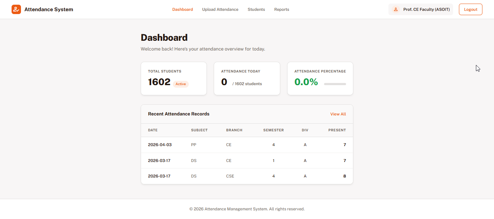
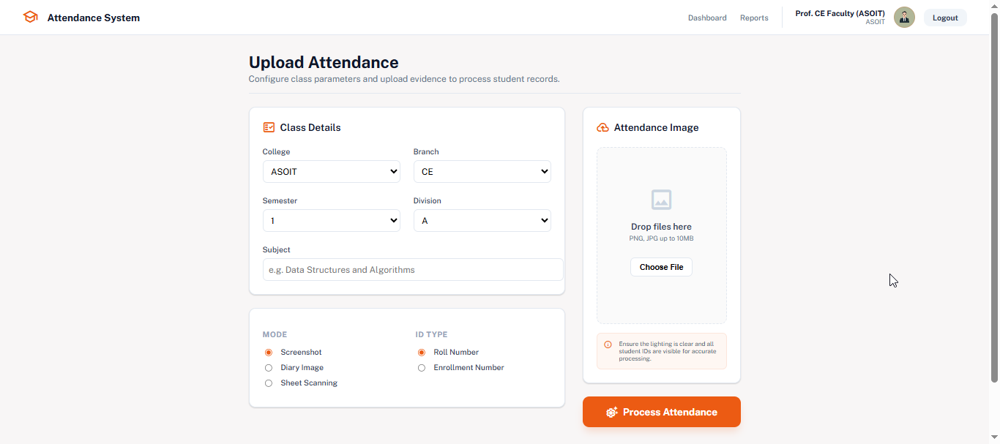
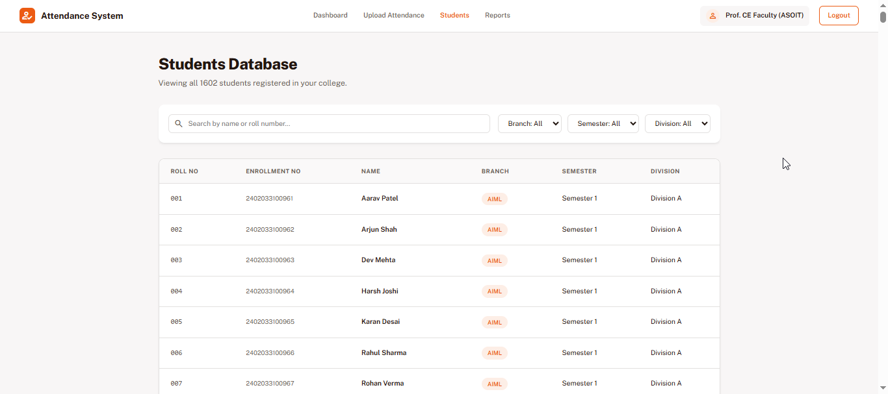
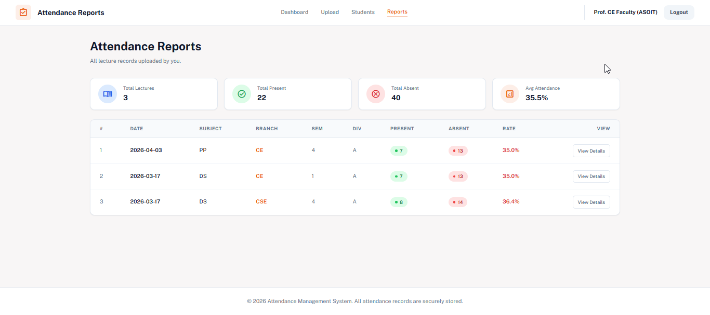

# 📋 AI-Based Attendance Digitization System


> An AI-powered web application that digitizes manual attendance records using OCR and Image Processing — eliminating the need for faculty to manually re-enter attendance data into college portals.
> This project was independently designed and developed as a practical solution for attendance digitization using OCR and image processing.

---

## 📌 The Problem

Faculty members in colleges mark attendance manually on:
- Printed attendance sheets
- Personal diaries/notebooks
- Digital screenshots/notes

They then have to **re-enter the same data** into the official college ERP portal — causing:
- ⏱️ Time wastage
- ❌ Human errors during data entry
- 📋 Duplicate effort
- 🔄 Delayed attendance updates

---

## 💡 The Solution

Instead of replacing the paper-based system, this project **digitizes it**.

Faculty takes a **single photo** of their attendance record → the system automatically extracts roll numbers using OCR → attendance is saved directly to the database.

**No additional hardware. No internet dependency. No behavioral change required for faculty.**

---

## ✨ Features

- 🔐 **Faculty Login System** — secure session-based authentication
- 📸 **Three Input Modes:**
  - **Diary Mode** — handwritten roll numbers (EasyOCR)
  - **Screenshot Mode** — digital attendance lists (Tesseract)
  - **Sheet Mode** — printed attendance sheets with P marks (OpenCV + Tesseract)
- 👁️ **OCR Preview** — faculty reviews extracted data before confirming
- ✅ **Smart Present/Absent Detection** — solidity-based blob analysis for P mark detection
- 🗄️ **Database Storage** — lecture-wise attendance with complete records
- 📊 **Results Dashboard** — present/absent split with percentages
- 📥 **Export Options** — download attendance as CSV or print as PDF
- 👥 **Students Database** — searchable, filterable student records
- 📈 **Reports Page** — complete lecture history with attendance rates
- 🏫 **Multi-College Support** — multiple branches and semesters

---
## 📸 Application Screenshots

### 🔐 Login System


### 📊 Dashboard


### 📤 Attendance Upload & OCR Processing


### 👥 Students Database


### 📈 Attendance Reports



---
## 🏗️ System Architecture

```
Faculty uploads image
        ↓
Flask receives image + form data
        ↓
OCR Module selected based on mode
   ├── Diary Mode    → EasyOCR (handwriting recognition)
   ├── Screenshot    → Tesseract PSM6 (digital text)
   └── Sheet Mode    → OpenCV morphology + Tesseract (grid detection)
        ↓
Extracted roll numbers matched against Students DB
        ↓
OCR Preview shown to faculty
        ↓
Faculty confirms → Attendance saved to SQLite DB
        ↓
Results page with present/absent breakdown
```

---

## 🛠️ Tech Stack

| Layer | Technology |
|-------|-----------|
| Backend | Python, Flask |
| OCR Engine 1 | EasyOCR (handwritten diary mode) |
| OCR Engine 2 | Tesseract OCR (screenshot + sheet mode) |
| Image Processing | OpenCV |
| Database | SQLite |
| Frontend | HTML, CSS, Material Symbols |
| Session Management | Flask Sessions |

---

## 📂 Project Structure

```
Attendance-Digitization-System/
├── app.py                  ← Flask application & all routes
├── database.py             ← SQLite setup & table creation
├── populate_db.py          ← Dummy data population script
├── attendance.db           ← SQLite database (auto-created)
├── src/
│   ├── ocr_diary_easyocr.py    ← Diary mode OCR
│   ├── ocr_screenshot.py       ← Screenshot mode OCR
│   └── model_grid_detector.py  ← Sheet mode OCR + grid detection
├── templates/
│   ├── login.html
│   ├── dashboard.html
│   ├── upload.html
│   ├── ocr_preview.html
│   ├── results.html
│   ├── students.html
│   └── reports.html
├── static/
│   └── uploads/            ← Uploaded images stored here
└── requirements.txt
```

---

## ⚙️ Installation & Setup

### Prerequisites
- Python 3.10+
- Tesseract OCR installed on your system
- Git

### 1. Clone the repository
```bash
git clone https://github.com/DarthOberon/Attendance-Digitization-System.git
cd Attendance-Digitization-System
```

### 2. Create virtual environment
```bash
python -m venv venv

# Windows
venv\Scripts\activate

# Mac/Linux
source venv/bin/activate
```

### 3. Install dependencies
```bash
pip install -r requirements.txt
```

### 4. Install Tesseract OCR
- **Windows:** Download from [UB-Mannheim](https://github.com/UB-Mannheim/tesseract/wiki) and add to PATH
- **Linux:** `sudo apt install tesseract-ocr`
- **Mac:** `brew install tesseract`

### 5. Setup the database
```bash
python populate_db.py
```
This creates `attendance.db` with sample faculty and student data.

### 6. Run the application
```bash
python app.py
```

Open your browser and go to: `http://127.0.0.1:5000`

---

## 🔑 Default Login Credentials

| College | Email | Password |
|---------|-------|----------|
| CSE (ASOIT) | `cse.asoit@university.ac.in` | `faculty123` |
| CE (ASOIT) | `ce.asoit@university.ac.in` | `faculty123` |
| IT (SOCET) | `it.socet@university.ac.in` | `faculty123` |

> All faculty accounts use the same default password: `faculty123`

---

## 📱 How to Use

### Step 1 — Login
Enter your faculty email and password.

### Step 2 — Upload Attendance
Select:
- College, Branch, Semester, Division
- Subject name
- Input mode (Diary / Screenshot / Sheet)
- ID Type (Roll Number / Enrollment Number)
- Upload your attendance image

### Step 3 — Review OCR Results
Check the extracted roll numbers. Matched numbers are shown as verified, unrecognized numbers are flagged for review.

### Step 4 — Confirm
Click **Confirm Attendance** to save to the database.

### Step 5 — View Results
See the complete present/absent breakdown. Export as CSV or print as PDF.

---

## 🧪 OCR Modes Explained

### 📓 Diary Mode
- Handles **handwritten roll numbers** in faculty diaries
- Uses **EasyOCR** with custom preprocessing pipeline
- Constraints: use dark pen, write `1` with a top dash, no line through `7`
- Accuracy: ~80-85% on handwritten input
- Runs fully **offline** — no API or internet required

### 📸 Screenshot Mode
- Handles **digital screenshots** of attendance lists (WhatsApp, Excel, notes)
- Uses **Tesseract PSM 6** with regex-based number filtering
- Accepts roll numbers (1-3 digits) and enrollment numbers (13 digits)
- Accuracy: ~97% on clean digital text

### 📄 Sheet Mode
- Handles **photographed printed attendance sheets**
- Uses **OpenCV** morphological operations for grid line detection
- Projection-based line detection for robust row/column identification
- Per-cell adaptive thresholding handles varying lighting conditions
- **OMR-style P mark detection** using solidity-based blob analysis
- Accuracy: High accuracy on well-photographed portrait-orientation sheets
---

## 🔬 Technical Highlights

- **No ML training required** — uses pre-trained EasyOCR models
- **Offline first** — entire pipeline runs locally without internet
- **PSM fallback chain** — tries PSM 7 → 8 → 13 for maximum OCR coverage
- **Y-coordinate grouping** — robust row detection even when grid cells are missing
- **Adaptive thresholding** — handles real-world lighting variations in photos
- **Solidity-based OMR** — rejects grid line artifacts when detecting P marks
- **Session-based auth** — faculty data isolated per login session

---

## ⚠️ Limitations

- Sheet mode requires portrait orientation photo
- Diary mode has constraints on handwriting style (dark pen, specific digit style)
- Currently runs locally — not deployed due to heavy OCR dependencies (~1.5GB)
- Mobile UI not yet responsive

---

## 🔮 Future Scope

- Mobile responsive UI
- Perspective correction for angled sheet photos
- Docker containerization for cloud deployment
- Email/WhatsApp notifications to absent students
- Student portal for self attendance checking
- Attendance analytics and trend visualization
- Face recognition as a fourth input mode

---

## 👤 About

Developed independently by Aryan Sharma — a Computer Science student at Silver Oak University, Ahmedabad with a focus on backend development and practical AI/ML applications.

This project demonstrates end-to-end development skills including:
- OCR pipeline development and optimization
- Flask web application architecture
- Database design and management
- Image processing with OpenCV
- Real-world problem solving with offline-first approach

📫 Interested in backend development, OCR systems, and software engineering opportunities.

---

## 📄 License

This project is licensed under the [MIT License](LICENSE).

---

<p align="center">Built with ❤️ and a lot of debugging 🐛</p>
